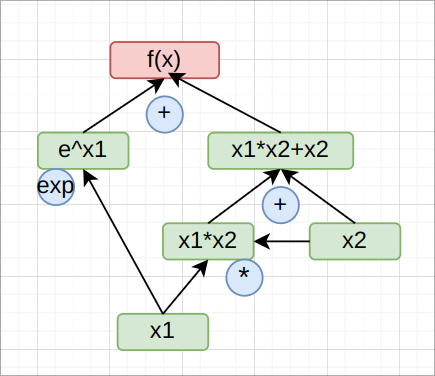

# A simple implementation of tensorflow

在计算目标函数的值时候，通常我们需要求出目标函数的子函数的值,eg.f(x)=3*g(x),我们需要求出g(x)的值
如果目标函数是一个复杂的多元函数f(x1,x2..)，我可以将其拆成多级子函数，构建一个计算图，在需要的时候给出变量
的输入值，通过计算图则可轻易得到目标函数的值

具体的如下
$$f(x_1,x_2) = e^{x_1}+ x_1x_2 + x2 $$



可以目标函数进行多级拆分，图中的每个函数（包括目标函数）视为节点(Node),任意的一次拆分为操作符号(Op)
- 在本次任务中，我们希望能够实现目标函数的自动拆分并构建出这样的一个计算图，框架代码已经给出Node和Op的定义
- 在进行每个case的测试时，都需要先进行变量(Varaiable)的声明和实例化，对于$ y = x_1+x_2 $ 这样的例子，就需要声明x1和x2， 并给出目标函数的表达式
```python
x1 = Variable('x1') # 思考x1,x2是不是也是Node呢？
x2 = Variable('x2')

y = x1 add x2
```
- 通过给出的输入值和计算图，即可计算y的真实值
```python
x1_val = x1_input# eg.[1,1]
x2_val = x2_input# eg.[2,2]
y_val =  forward according the graph,x1_val,x2_val
```
- 是否还记得梯度下降法？我们需要每个变量的梯度，才能对权重进行更新，因此还需要计算每个变量的梯度的形式（自动微分），需要实现gradient算法
需要注意的是，在计算某一个变量的梯度时，该变量的梯度来源可能有多个，比如最开始的例子 x1的梯度来源于上一层的指数运算和乘法运算
```python
grad_x1 , grad_x2 = gradient algorithm according graph
````
**reference**:

[https://zh.d2l.ai/chapter_multilayer-perceptrons/backprop.html]
[https://zh.d2l.ai/chapter_preliminaries/autograd.html]

需要在**TODO**的地方补充代码，使得框架完整,**hint**标签是对应的提示,并不是所有地方都有提示
## task0
阅读源码，补充代码，跑通case0
```shell
python test.py --case 0
```
## task1 
实现梯度计算，跑通case1
使用以下指令进行case1的测试
```shell
python test.py --case 1
```
## task2
阅读源码，补充代码，实现相应op, 跑通所有case
使用以下命令运行所有测试样例
```shell
python test.py --case all
```